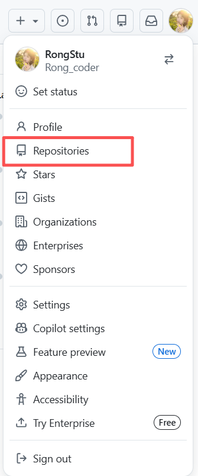
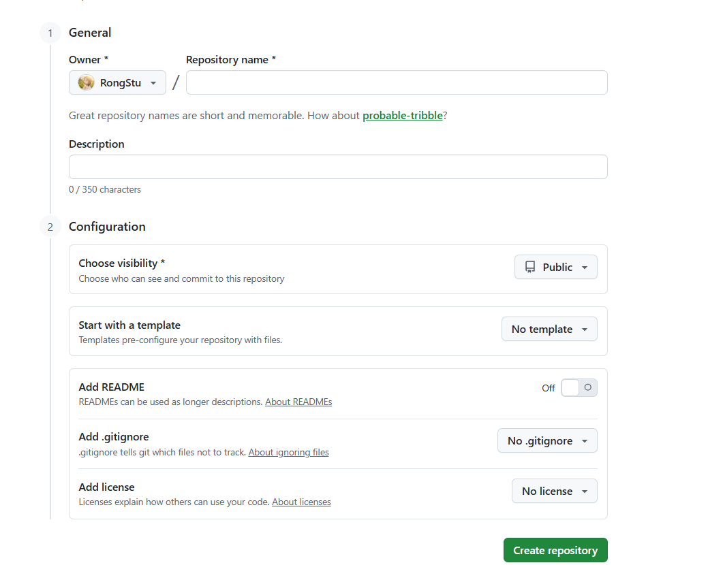
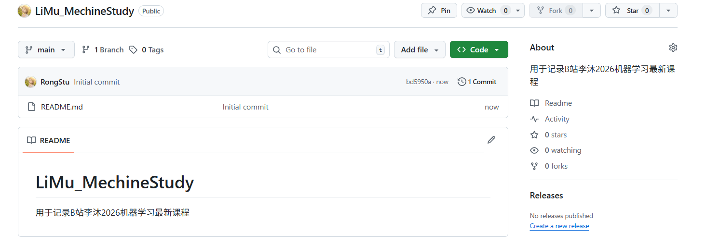

### Github 创建仓库操作 

1. 登录github官网（https://github.com/），登录github账号，如果没有github账号，使用QQ邮箱或者网易邮箱进行注册。

2. 点击右上角头像，选择其中的Repositories，进入个人仓库网页，参考如下：
    

3. 点击New按钮，进入创建仓库界面，参考如下：
    
     - Repository name 即为新建仓库名称
     - Description 为对该仓库功能的描述
     - Configuration 为对该仓库的配置：
        - Choose visibility：选择该仓库的属性为public和private
        - Add README:添加说明文档

4. 点击右下角的Create repository 即可创建成功，创建成功后的界面如下：
    
    - 点击add file即可添加最新的文件内容，但是本人打算分别通过使用git指令的方法以及vscode自带的仓库上传功能完成上传。